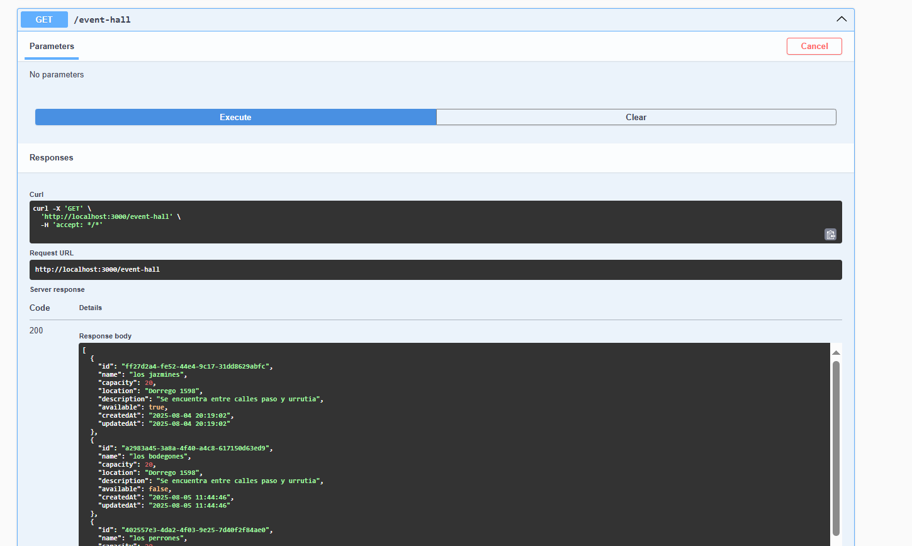
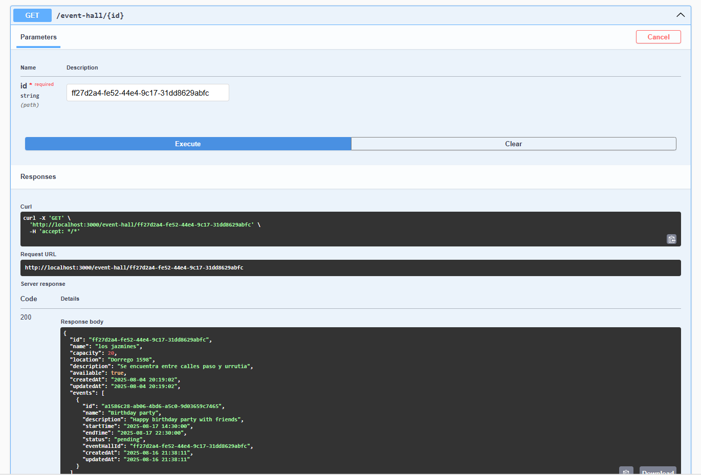

# API de Gestión de Salones y Eventos 🎉

Este proyecto es una API funcional creada con **NestJS** para gestionar salones de eventos y sus respectivas reservas. El objetivo principal es demostrar un CRUD funcional, orientado a la administración de salones y el manejo de eventos pendientes en los salones.

## 🚀 Funcionalidades

### 🏢 Salones de eventos (EventHall)
- **Crear salón:** Se puede crear un salón con disponibilidad activa si se quiere.
- **Modificar salón:** Se puede modificar y desactivar su disponibilidad.
- **Obtener salones:** Listado de salones sin incluir sus eventos.
- **Eliminar salón:** Solo se puede eliminar si no tiene eventos pendientes.
- **Ver eventos por salón:** Listado de eventos asociados a un salón por id.

### 📅 Eventos
- **Crear evento:** Se puede reservar un evento si el salón está disponible.
- **Consultar evento:** Por id consultas información del evento.
- **Cancelar evento:** Elimina el evento de la base de datos.
- **Marcar como confirmado:** Se elimina también de la base para dejar solo eventos pendientes visibles.
- **Actualizar evento:** Se puede actualizar el nombre y la descripción del evento.

> En esta demo, los eventos cancelados o completados se eliminan directamente para mantener la tabla limpia. En una versión escalada, podrían moverse a una tabla de historial.

## 🛠️ Tecnologías

- **NestJS** como framework principal
- **TypeScript** para tipado estático
- **Prisma** como ORM
- **PostgreSQL** como base de datos relacional
- **Swagger** para documentación de la API
- **Docker** para despliegue rápido


## ⚙️ Requisitos previos
Tener instalado Docker y Docker Compose para levantar la base de datos.

Tener instalado Node.js y pnpm para gestionar dependencias y correr la API.

Puerto 5450 libre para PostgreSQL (puerto mapeado en Docker).

Puerto 8080 libre para PgAdmin.

Configura el archivo .env con las credenciales de la base de datos.

## 📦 Instalación


```bash
git clone https://github.com/Francotorrico/APIevents
cd APIevents
pnpm install
docker compose up -d
pnpm start:dev
```
## 📜 Documentación con Swagger

Una vez que la API esté corriendo, podés acceder a la documentación interactiva en:

http://localhost:3000/api

Aquí vas a poder:

Ver todos los endpoints

Probar las peticiones directamente desde el navegador

Consultar ejemplos y modelos de datos

### 🔹 Swagger UI
A continuación, se muestran capturas de la documentación de la API generada con Swagger:







### 🔹 Diagrama Entidad-Relación (DER)

Este es el modelo de base de datos utilizado en el proyecto:


## 📋 Validaciones principales
La fecha de inicio debe ser menor que la de fin.

Un salón solo se elimina si no tiene eventos pendientes y  disponibilidad está en false.

El horario de inicio y fin debe ser en el horario local de Argentina. 

## 📄 Notas de desarrollo

<details> <summary>Ver detalles</summary>

nest new APIfuncional

Parte de mi DB

creando docker-compose para postgres y luego usar el comando 
docker compose up -d
luego usar prisma studio o en este caso localhost:8080

### agrego dependencia de prisma
 pnpm add -D prisma

### inicializo prisma
pnpm prisma init

### configuro el env. de prisma

En esta parte ya configuro mi schema.prisma y aplico 
 pnpm prisma migrate dev --name init , se aplica generate 

### En carpeta src -> prisma, es donde guardo prisma.module.ts y prisma.service.ts

usamos validaciones como 
pnpm add class-validator class-transformer
y en main.ts agregamos ValidationPipe, seria 
app.useGlobalPipes(new ValidationPipe)

### pasos para generar el CRUD
nest g resource EventHall --no-spec
nest g resource Event --no-spec

</details>

## 🚧 Próximas mejoras

- Implementar **tabla de historial** para eventos cancelados o completados, o en su defecto aplicar **soft delete** (borrado lógico) para conservar registros.
- Autenticación y roles de usuario (admin / cliente).
- conexion front-end con el backend para la gestión visual de reservas.
- implementar el encontrar todos los eventos de un cliente o empresa.


## 🤝 Autor: Franco Torrico
📌 Proyecto personal para practicar NestJS, Prisma, docker, swagger y lógica de negocio en APIs REST.